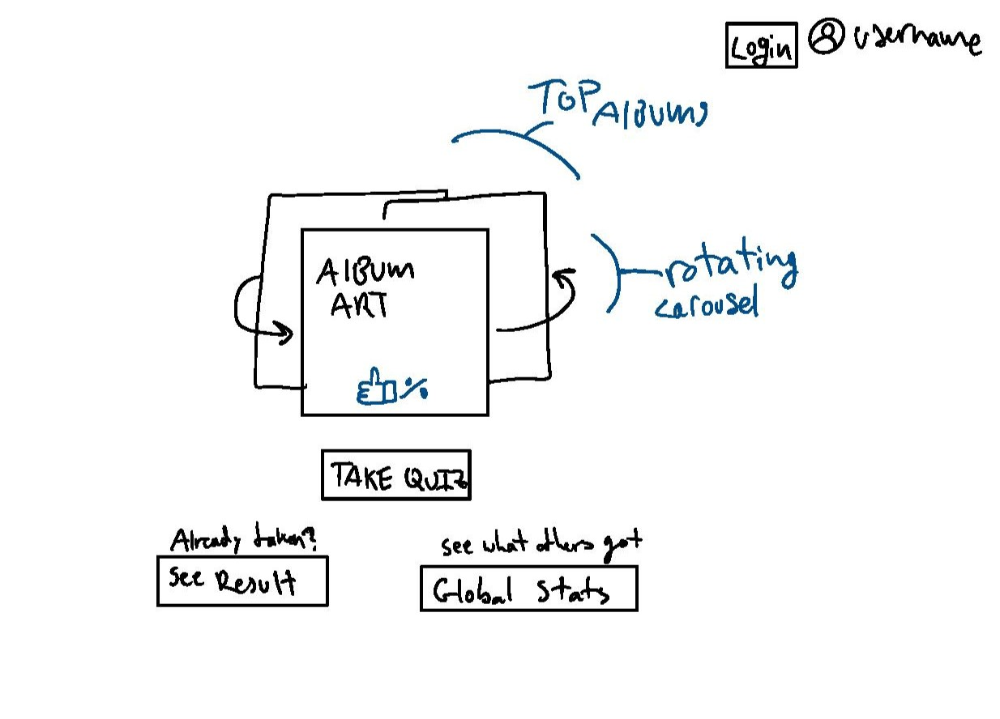
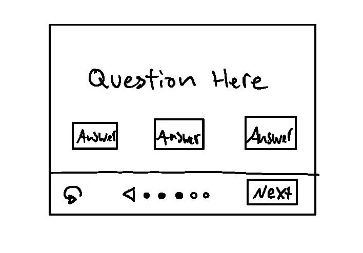
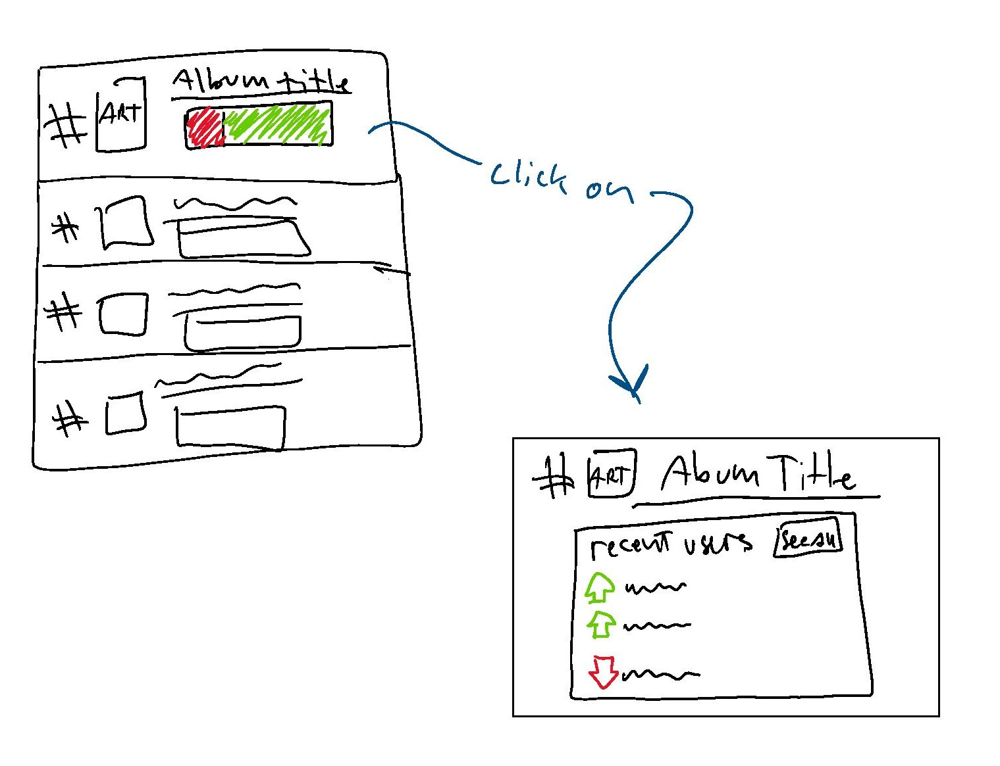

# startup: :crocodile: KGLW Album Finder :crocodile:

## Startup specification

### Elevator pitch

King Gizzard and the Lizard Wizard (or KGLW) is an Australian rockband famous for their wild variety in music styles. Since their beginnings in 2010, they have recorded 24 albums - each with their own take on a different genre. As a huge fan of the band myself, it is often very hard to recommend the band to others because I never know which album they would like best. My KGLW Album Finder application is the solution for this problem. The app will, through a series of personality and music preference questions, narrow down which album the user should start with. On top of this, it will also be able to tell the user which song to check out first, and which other albums (including those from other bands) they could explore next. Through the app, users will also be able to see which albums have been recommended the most - with real-time statistics from other users on whether or not they approved of the recommendations given.

### key features

- Login to view past results
- Selectable interactive buttons with questions
- Display of album art
- Back button to select different answers
- Button with "Start Over" option
- Ability to listen to soundbites of different albums
  - (if I can figure out how to do this)
- Persistant storing of results / progress
- Top recommended albums list (real time updating)
  - with total votes included
  - ablility to add a name to your vote
    - "See who likes this album", etc.
- Up/Down-voting buttons for final recommendations
- Links to recommended albums
  - and to band info (website/youtube/etc.)
  - don't worry about copyright issues, the band is all about free distribution (they secretly run the bootleg account for their own music)
- App theme changes dynamically with final recommendation

### Design

#### Splash / main page

#### Quiz card basic layout

#### Global stats page

### Technologies*:

- HTML - Minimal number of pages with HTML structuring. Links to various external websites
- CSS - Good symplistic and dynamic styling, workable with different screen sizes
- JavaScript - Used for login, backend calls, and displaying/selection of data
- Calling web services - storing of user data (progress through quiz, login info)
- Providing web services - Displaying of user data (includes other user data)
- Authentication - Login functionality if users want to save their progress / recommendations
- Persistant data storing - saving user choices as they are made
- WebSocket data: Shows real time data in the community section
  - Most recommended albums / who likes those albums / etc.

*note that I do not understand all of these completely yet

[Notes](notes.md)
