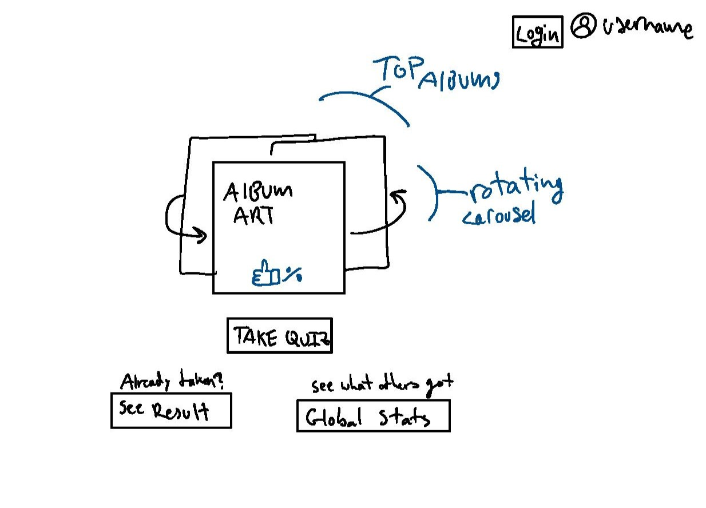
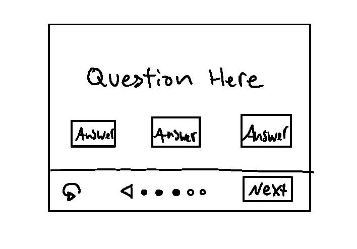
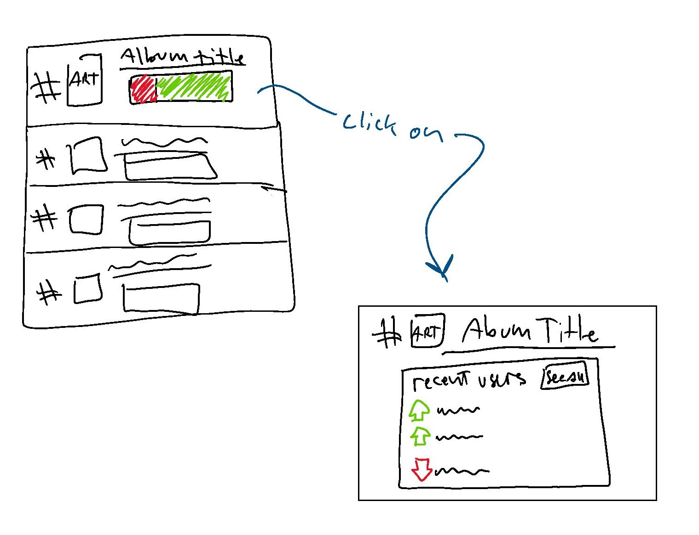

Useful links:  [📑Notes](notes.md)

# startup: :crocodile: KGLW Album Finder :crocodile:

## Startup specification

### Elevator pitch

King Gizzard and the Lizard Wizard (or KGLW) is an Australian rockband famous for their wild variety in music styles. Since their beginnings in 2010, they have recorded 24 albums - each with their own take on a different genre. As a huge fan of the band myself, it is often very hard to recommend the band to others because I never know which album they would like best. My KGLW Album Finder application is the solution for this problem. The app will, through a series of personality and music preference questions, narrow down which album the user should start with. On top of this, it will also be able to tell the user which song to check out first, and which other albums (including those from other bands) they could explore next. Through the app, users will also be able to see which albums have been recommended the most - with real-time statistics from other users on whether or not they approved of the recommendations given.

### key features

- Login to view past results
- Selectable interactive buttons with questions
- Display of album art
- Back button to select different answers
- Button with "Start Over" option
- Ability to listen to soundbites of different albums
  - (if I can figure out how to do this)
- Persistant storing of results / progress
- Top recommended albums list (real time updating)
  - with total votes included
  - ablility to add a name to your vote
    - "See who likes this album", etc.
- Up/Down-voting buttons for final recommendations
- Links to recommended albums
  - and to band info (website/youtube/etc.)
  - don't worry about copyright issues, the band is all about free distribution (they secretly run the bootleg account for their own music)
- App theme changes dynamically with final recommendation

### Design

#### Splash / main page

#### Quiz card basic layout

#### Global stats page

### Technologies*:

- HTML - Minimal number of pages with HTML structuring. Links to various external websites
- CSS - Good symplistic and dynamic styling, workable with different screen sizes
- JavaScript - Used for login, backend calls, and displaying/selection of data
- Calling web services - storing of user data (progress through quiz, login info)
- Providing web services - Displaying of user data (includes other user data)
- Authentication - Login functionality if users want to save their progress / recommendations
- Persistant data storing - saving user choices as they are made
- WebSocket data: Shows real time data in the community section
  - Most recommended albums / who likes those albums / etc.

*note that I do not understand all of these completely yet

## HTML Deliverable 

Built the base structure of my startup application using exclusively HTML

- **HTML** - 5 HTML pages: index, login, quiz, results, and stats
- **Links** - All pages accessable from `index.html`, and all pages lead into one another linearly
- **Textual Content** - Plenty of descriptive text and examples/placeholders in each page.  Some quiz content written as a placeholder.
- **3rd party service calls** - Placeholders for most popular songs from the albums inluded.  Also a miniplayer from SoundCloud is included, but I don't know if that counts
- **Images** - Got a few album covers in there, as well as an image for the name of the band.
- **Login** - Accessable from every page, with a placeholder html page.  Will make it a pop-up style card later on so the user can log in at any point during the quiz
- **Database** - Album statistics + user info will be held in the database.  The `stats.html` page has a placeholder box to represent this info
- **WebSocket** - Up/down-voting results will be updated in realtime both in the `results.html` and `stats.html` pages.  Placeholder text and forms are located in these as well.

## CSS Deliverable

Added a great deal of both CSS and Bootstrap to my application (also started down a little rabbithole of JS, but I stopped)

- **Header, footer, main content body** - Added bootstrap headers and footers for each page, the main splash page has a unique one that includes the forms for logging in + signing up.  Added styling for the little logo shown in the chrome tab. Flexbox was used heavily in all parts of the app. None of the colors / theming is final at the moment. I'm hopeing to encorperate it into the background coloring with a bit of JS or something.

- **Navigation elements** - Changed out all nav. aspects for bootstrap buttons.  Also added navigation aspects to the main quiz of the app.

 [!NOTE]
> NOTE: The button to get from the quiz to the results page will be on the final question card of the quiz, which I am unsure how to implement yet (JS plz) 

- **Responsive to window resizing** - I'm relying on flexbox and bootstrap for most of this.  Anything else should scale by vw.  I added code for detecting phone-sized screens, but ended up commenting it out for now, as it was causing a great deal of strife.  It took forever, but I got those background aligators to scale apropriately, I hope people like them.

- **application elements** - The splash page is pretty much in its final form, all it needs now is some JS for dynamically changing the background color to fit the album shown, as well as some tweaking of the album carousel (I want it to end up similar to [this](https://codepen.io/ifriedham/pen/QWzRdwV)). I have the framework for all the other aspects as well, just gotta wait for JS to apply them - it's going be either a lot of copy-and-pasting of these frameworks, or i did it right and things will go easily.  I'm especially proud of how the rankings ended up. Please ignore the current state of the quiz, it's going to rely pretty heavily on JS, as I plan on it being a dynamically changing card element that stays on the one page.  Same goes for the rankings page, It still needs 22 more albums, and I'd like them to be dynamically ranked.  OH and of course the recommended app will rely on JS or other database things.

- **Application text content** -  Ended up using 2 main fonts, one default and one that I've loaded with the app files.  I may change them around depending on visibility with a future color theme, but I kindof like how it's turned out so maybe not.

- **application images** - OH MAN I uploaded so many album covers into the /images file.  They are referenced at multiple points of the app - notably on the splash page, results page ("...then you should try:" section), and in the stats page.  I had a GIANT image that would slowley pan across in the background, but it was too busy.

- **notes** - I feel like I spent a lot more time this time just debugging. out of everything, I think I am most comfortable using flexbox - bootstrap gets convoluted quick, and I am still unclear on all the CSS rules